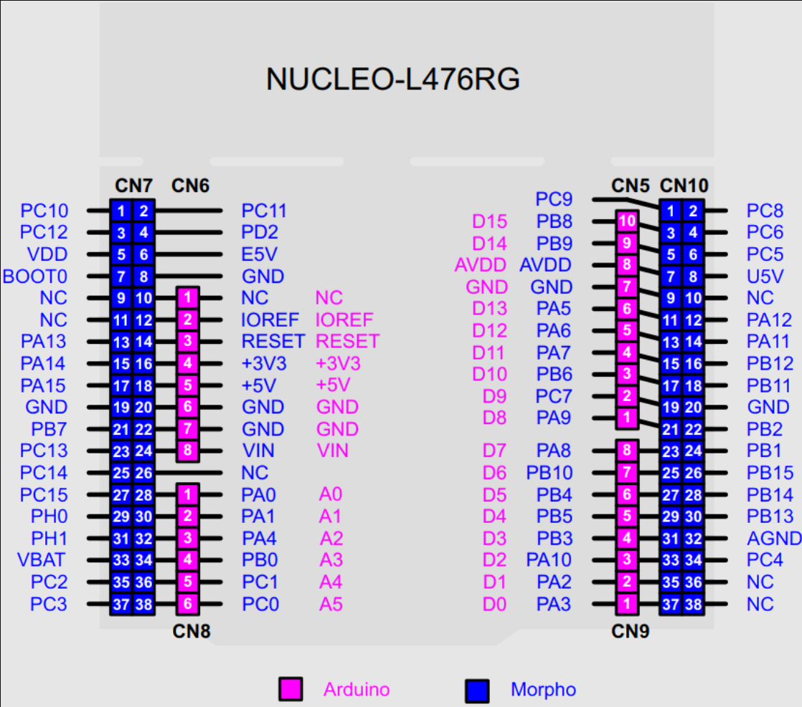

# RC_car_embedded_project

## PCB Portion 

- [NUCLEO-L476RG Footprints](https://www.snapeda.com/parts/NUCLEO-L476RG/STMicroelectronics/view-part/)
- [HC-05 Data Sheet](https://engineering.purdue.edu/477grp14/Team/journal/img%20-%20member3/documents/HC05.pdf)
- [Joystick Data Sheet](https://naylampmechatronics.com/img/cms/Datasheets/000036%20-%20datasheet%20KY-023-Joy-IT.pdf)

--- 
